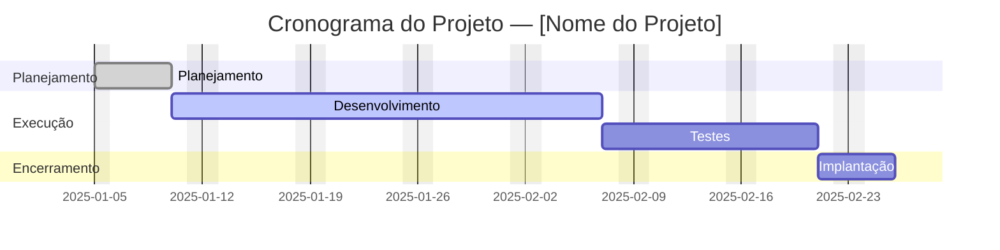

# Artefatos do Processo de Software

Este documento descreve os artefatos fundamentais que orientam e materializam o trabalho em nosso ciclo de desenvolvimento de software, garantindo alinhamento e qualidade desde a concepção até a entrega.

---

## 1. Documento de Visão do Produto

### Finalidade

A **Documento de Visão** é o alicerce estratégico do projeto. Ele articula a razão de ser do produto, define suas fronteiras em alto nível e apresenta a justificativa de negócio que impulsiona sua construção. Funciona como o principal ponto de alinhamento entre as partes interessadas (negócio, produto, tecnologia), estabelecendo **o que** precisa ser feito e **por quê**.

### Template

```markdown
# Documento de Visão do Produto — [Nome do Sistema]

**Discentes:** [Nomes dos integrantes do grupo]  
**Projeto:** [Nome do sistema/produto]

---

## 1. Visão Geral do Produto
Descreva de forma clara e resumida o propósito do sistema, seu público principal e os principais objetivos.  
Exemplo:  
> O [nome do sistema] é uma plataforma [web/mobile/etc.] desenvolvida para [finalidade principal], oferecendo funcionalidades de [resumo das principais operações]. O objetivo é [problema que resolve] e [benefício que traz].

---

## 2. Público-alvo
Liste os tipos de usuários e descreva o papel de cada um no sistema.

- **[Tipo de Usuário 1]:** [Descrição resumida das responsabilidades e uso do sistema].  
- **[Tipo de Usuário 2]:** [Descrição].  
- **[Tipo de Usuário 3]:** [Descrição].

---

## 3. Necessidade de Negócio / Justificativa
Explique o **problema** ou **necessidade** que o produto resolve e os **benefícios esperados**.

- **Operacional:** [Melhorias internas, automação, eliminação de processos manuais].  
- **Comercial:** [Aumento de receita, fidelização de clientes, competitividade].  
- **Decisional:** [Dados e métricas que o sistema oferece para tomada de decisão].  

---

## 4. Fluxos de Acesso / Autenticação
Descreva como cada tipo de usuário acessa o sistema e quais permissões possui.

- **[Tipo de usuário]:** [Como se cadastra / faz login / o que visualiza].  
- **[Tipo de usuário]:** [Fluxo de autenticação e acesso].  

---

## 5. Escopo

### Incluído
Liste tudo o que **faz parte do projeto (MVP)**:

- [Funcionalidade 1].  
- [Funcionalidade 2].  
- [Funcionalidade 3].  
- [Outros recursos planejados].  

### Excluído
Liste o que **não será incluído inicialmente**:

- [Funcionalidade ou módulo fora do escopo].  
- [Tecnologias ou integrações futuras].  

---

## 6. Principais Funcionalidades / Épicos
Apresente os grandes blocos de funcionalidades (épicos) do sistema.  
Cada item pode representar um módulo principal.

- **[Nome do épico/módulo]:** [Descrição resumida do que faz].  
- **[Outro módulo]:** [Descrição].  

---

## 7. Riscos
Liste os principais riscos que podem afetar o sucesso do projeto.

- [Risco 1: descrição e possível impacto].  
- [Risco 2: descrição].  
- [Risco 3: descrição].  
---

```

---

## 2. Documento de Requisitos

### Finalidade
Define o propósito, o contexto de negócio e as funcionalidades que o sistema deve oferecer, incluindo os requisitos funcionais, não funcionais e regras de negócio.
É o ponto de partida para o entendimento do que o sistema fará e como deverá se comportar.

### Template

```markdown
# Documento de Requisitos do Sistema

---

**Discentes:** [Nomes dos autores]  
**Projeto:** [Nome do Projeto]  

---

## Registro de Alterações

| Versão | Responsável | Data | Alterações |
|:------:|:-------------|:------:|:-----------|
| 1.0 | [Nome] | [Data] | Criação do documento de requisitos. |

---

## 1. Introdução
Este documento apresenta a especificação inicial para o sistema **[Nome do Sistema]**.  
Ele tem como objetivo detalhar o propósito, contexto de negócio, diagrama de domínio e os requisitos funcionais, não funcionais e regras de negócio.

---

## 2. Descrição do Propósito do Sistema
Descreva o propósito principal do sistema.  
> Exemplo:  
> O sistema tem como objetivo centralizar as operações de [setor/negócio] em um ambiente digital, facilitando o gerenciamento de [recursos/processos] e promovendo maior eficiência e organização para todos os envolvidos.

---

## 3. Descrição do Minimundo
Apresente o contexto do negócio (o “mundo real” representado pelo sistema).  
Explique:
- Quem são os principais atores;
- Quais operações eles realizam;
- Como as informações são organizadas e relacionadas.  

> Exemplo:  
> O sistema permite que [usuário principal] realize [ações], enquanto [outro ator] gerencia [tarefas específicas].  
> As informações sobre [entidades] são armazenadas e relacionadas para garantir [benefício ou automação].

---

## 4. Diagrama de Domínio
Inclua o diagrama de domínio representando as entidades principais e seus relacionamentos.

---

## 5. Requisitos de Usuário

### 5.1 Requisitos Funcionais

| ID | Nome | Descrição | Prioridade | Dependência |
|:---:|:------|:-------------|:-----------:|:-------------|
| RF01 | [Nome do requisito] | [Descrição funcional detalhada] | [Alta/Média/Baixa] | [Outros RFs] |
| RF02 |  |  |  |  |
| RF03 |  |  |  |  |

---

### 5.2 Requisitos Não Funcionais

| ID | Nome | Descrição | Prioridade | Dependência |
|:---:|:------|:-------------|:-----------:|:-------------|
| RNF01 | [Nome do requisito] | [Descrição técnica ou restrição] | [Alta/Média/Baixa] | [Dependências] |
| RNF02 |  |  |  |  |
| RNF03 |  |  |  |  |

---

### 5.3 Regras de Negócio

| ID | Nome | Descrição | Prioridade | Dependência |
|:---:|:------|:-------------|:-----------:|:-------------|
| RN01 | [Nome da regra] | [Descrição da regra de negócio] | [Alta/Média/Baixa] | [Dependências] |
| RN02 |  |  |  |  |
| RN03 |  |  |  |  |

---

```

---
## 3. Documento de Especificação de Requisitos

### Finalidade
Detalha tecnicamente o comportamento do sistema, descrevendo os casos de uso, atores, fluxos de interação e diagramas.
Serve como guia para desenvolvimento, testes e validação, garantindo que todos os requisitos sejam corretamente implementados.

### Template

```markdown
# Documento de Especificação de Requisitos

---

**Discentes:** [Nomes dos autores]  
**Projeto:** [Nome do Projeto]  

---

## Registro de Alterações

| Versão | Responsável | Data | Alterações |
|:------:|:-------------|:------:|:-----------|
| 1.0 | [Nome] | [Data] | Criação do documento e diagramas. |

---

## 1. Introdução
A presente especificação tem como objetivo descrever de forma clara e estruturada as funcionalidades e regras do sistema **[Nome do Sistema]**.  
Serve como base para alinhamento entre desenvolvedores, stakeholders e usuários, descrevendo:
- Casos de uso e fluxos de interação;
- Condições e regras para o correto funcionamento do sistema;
- Requisitos que devem ser implementados e testados.

---

## 2. Modelo de Caso de Uso do Sistema

### 2.1 Diagrama de Caso de Uso

### 2.2 Descrição dos Atores

| Nome | Descrição |
|:------|:------------|
| [Ator 1] | [Função e papel no sistema]. |
| [Ator 2] | [Função e papel]. |
| [Ator 3] | [Função e papel]. |

---

### 2.3 Descrição Geral dos Casos de Uso (ICAE)
| ID | Nome | Descrição | Ações Possíveis | Observações | Atores | Requisitos Relacionados | Classes Envolvidas |
|:---:|:------|:-------------|:----------------|:-------------|:-----------|:--------------------------|:-------------------|
| CDU01 | [Nome do caso de uso] | [Descrição geral da funcionalidade] | [I, C, A, E] | [Observações complementares] | [Atores envolvidos] | [RFs / RNs] | [Entidades do modelo] |
| CDU02 |  |  |  |  |  |  |  |
| CDU03 |  |  |  |  |  |  |  |

---

### 2.4 Especificação Detalhada dos Casos de Uso
Cada caso de uso deve seguir o formato abaixo:

#### CDUXX — [Nome do Caso de Uso]
**Escopo:** [Nome do Sistema]  
**Propósito:** [Objetivo principal do caso de uso]  
**Ator:** [Principal ator envolvido]  
**Pré-condições:** [Condições necessárias antes da execução]  
**Pós-condições:** [Resultados esperados após execução]

**Fluxo Normal:**
1. [Etapa 1]
2. [Etapa 2]
3. [Etapa 3]
4. [Etapa 4]

**Fluxo de Exceção:**
- [Condição de erro 1 → resposta do sistema]
- [Condição de erro 2 → resposta do sistema]

**Requisitos Relacionados:** [RFs e RNs vinculados]  

---

## 3. Diagrama de Classe do Sistema

```

---
## 4. Especificação

### Propósito

As **Especificações** descrevem uma funcionalidade do sistema a partir da perspectiva de quem a utiliza. Seu principal objetivo é focar no **valor** entregue ao usuário, detalhando o requisito de forma concisa e testável. Cada especificação funciona como uma unidade de trabalho para a equipe de desenvolvimento e normalmente inclui atores, pré/pós-condições, fluxo normal e fluxos de exceção, critérios de aceitação e requisitos relacionados.

### Template

```markdown
# REQ## — <Título do Requisito>

**ESCOPO:**  
- [Funcionalidade essencial 1]  
- [Funcionalidade essencial 2]  
- [Funcionalidade essencial 3]  

**PROPÓSITO:**  
- [Descrição resumida do objetivo do requisito]  

**ATOR:**  
- [Ator responsável pela execução do caso de uso]  

---

## PRÉ-CONDIÇÕES
- [Condição necessária antes da execução do caso de uso]  
- [Outra condição, se aplicável]  

## PÓS-CONDIÇÕES
- [Resultado esperado após a execução bem-sucedida]  
- [Outro efeito decorrente da execução, se aplicável]  

---

## FLUXO NORMAL
1. O [ator] acessa o módulo **“<nome da funcionalidade>”**.  
2. O sistema exibe o formulário ou interface correspondente.  
3. O [ator] preenche os campos obrigatórios ou seleciona as opções desejadas.  
4. O sistema valida as informações inseridas.  
5. O sistema executa a ação solicitada (ex: salvar, editar, excluir).  
6. O sistema confirma a operação com uma mensagem de sucesso e atualiza a interface.  

---

## FLUXO DE EXCEÇÃO
- **E1 — Dados obrigatórios ausentes:**  
  O sistema exibe mensagem de erro informando que todos os campos obrigatórios devem ser preenchidos.  

- **E2 — Dados inválidos ou duplicados:**  
  O sistema impede a ação e informa o motivo (ex: formato incorreto ou duplicidade).  

- **E3 — Falha no processamento:**  
  O sistema informa o erro e orienta o usuário a tentar novamente.  

---

## FLUXO ALTERNATIVO
- **A1 — Variação opcional do fluxo principal:**  
  1. O [ator] opta por uma ação alternativa.  
  2. O sistema executa o comportamento correspondente.  

---

## REQUISITOS RELACIONADOS
- **RF##:** [Requisito funcional relacionado]  
- **RN##:** [Regra de negócio relacionada]  
- **RNF##:** [Requisito não funcional relacionado]

```

---

## 5. Dicionário de Dados

### Finalidade

O **Dicionário de Dados** descreve detalhadamente todas as entidades, atributos e relacionamentos utilizados no sistema. Ele define o significado de cada dado, o tipo, formato e restrições, garantindo consistência e clareza entre as fases de análise, especificação e desenvolvimento.

### Estrutura Recomendada

| Campo                       | Descrição                                                          |
| --------------------------- | ------------------------------------------------------------------ |
| **Tabela.Campo**            | Nome completo (ex.: `usuarios.email`).                             |
| **Nome lógico**             | Nome legível e intuitivo do campo.                                 |
| **Tipo (SGBD)**             | Tipo de dado (ex.: `varchar(255)`, `uuid`, `timestamp`).           |
| **Obrigatório**             | Indica se o campo é obrigatório.                                   |
| **Descrição / Significado** | Explica o propósito do campo.                                      |
| **Exemplo**                 | Valor típico do campo.                                             |
| **Restrições / Validações** | Regras como único, PK, FK, formato, intervalo.                     |
| **Chave (PK/FK/Índice)**    | Indica função do campo na estrutura do banco.                      |

### Template

```markdown
# Dicionário de Dados — [Nome do Sistema]

| Tabela.Campo | Nome lógico | Tipo (SGBD) | Obrigatório | Descrição / Significado | Exemplo | Restrições / Validações | Chave (PK/FK/Índice) |
|---|---|---|---|---|---|---|---|---|---|---|
| `usuarios.id` | ID do usuário | `uuid` | Sim | Identificador único do usuário | `3fa85f64-5717-4562-b3fc-2c963f66afa6` | PK, não nulo | PK |
| `usuarios.email` | E-mail do usuário | `varchar(255)` | Sim | E-mail para login e contato | `joao@example.com` | único, formato email | Índice único |
| `pedidos.total` | Total do pedido | `numeric(10,2)` | Sim | Valor total do pedido | `149.90` | >=0 | — |
```

---

## 6. Produto (Software Executável)

O Produto é o artefato final e tangível de todo o processo. Representa o software funcional, testado e pronto para ser entregue aos usuários ou disponibilizado em um ambiente de produção/teste. É a manifestação concreta das especificações implementadas.

---

## 7. Plano de Testes

Documento que define a estratégia, técnicas e métricas usadas para validar o sistema, garantindo que todas as funcionalidades atendam aos requisitos e critérios de aceitação estabelecidos.

### Template

```markdown
# Plano de Testes — [Nome do Sistema]

## 1. Objetivo

Descrever o objetivo principal do plano de testes, como garantir que o sistema ou aplicação atenda aos requisitos e especificações definidas, validando a qualidade e funcionalidade do produto.

---

## 2. Estratégia

Definir a abordagem geral para os testes, incluindo os tipos de testes que serão realizados (como testes de funcionalidade, de desempenho, de segurança, etc.) e como os testes serão distribuídos ao longo do ciclo de vida do desenvolvimento.

---

## 3. Técnica

Especificar as técnicas de teste que serão aplicadas, como testes manuais, automação de testes, testes exploratórios, etc. Incluir também os métodos que serão utilizados para garantir a cobertura de testes eficiente.

---

## 4. Indicadores

Definir os indicadores que serão usados para medir o sucesso dos testes, como taxa de defeitos encontrados, cobertura de código, tempo de execução de testes, entre outros. Estes indicadores ajudarão a avaliar a qualidade do processo de testes e a efetividade das atividades realizadas.
```

## 8. Plano de Projeto

O Plano de Projeto é um artefato que organiza as principais informações sobre o planejamento e execução do projeto. Ele define o escopo, apresenta o cronograma de atividades, detalha a EAP (Estrutura Analítica do Projeto), e inclui as estimativas de esforço e custo, além de um cronograma em formato de Gantt para visualização das etapas e prazos. Esse documento serve como guia para o acompanhamento e controle do andamento do projeto.

``` markdown
# Template de Artefato — Plano de Projeto

> **Discentes:** [Nomes dos integrantes]  
> **Projeto:** [Nome do projeto]  
> **Versão:** [v1.0]  
> **Data:** [DD/MM/AAAA]

---

## 1. Escopo do Projeto

### 1.1 Objetivo
[Descreva de forma breve o objetivo principal do projeto.]

### 1.2 Entregáveis
- [Entregável 1]  
- [Entregável 2]  
- [Entregável 3]

### 1.3 Limites do Escopo
- [Itens que não estão incluídos no escopo do projeto.]

---

## 2. Cronograma

| Etapa | Descrição | Início | Término | Responsável |
|---|---|---|---|---|
| 1 | [Ex.: Planejamento] | [DD/MM/AAAA] | [DD/MM/AAAA] | [Nome] |
| 2 | [Ex.: Desenvolvimento] | [DD/MM/AAAA] | [DD/MM/AAAA] | [Nome] |
| 3 | [Ex.: Testes] | [DD/MM/AAAA] | [DD/MM/AAAA] | [Nome] |
| 4 | [Ex.: Implantação] | [DD/MM/AAAA] | [DD/MM/AAAA] | [Nome] |

---

## 3. EAP — Estrutura Analítica do Projeto

1. **Projeto:** [Nome do Projeto]  
   1.1 Planejamento  
   - 1.1.1 Levantamento de requisitos  
   - 1.1.2 Definição do cronograma  
   1.2 Execução  
   - 1.2.1 Desenvolvimento  
   - 1.2.2 Testes  
   1.3 Encerramento  
   - 1.3.1 Entrega final  
   - 1.3.2 Avaliação do projeto  

---

## 4. Estimativas de Esforço e Custo

| ID | Atividade | Esforço (horas) | Custo/hora (R$) | Custo total (R$) | Responsável |
|---|---|---:|---:|---:|---|
| 1 | [Ex.: Levantamento de requisitos] | [40] | [50,00] | [2000,00] | [Nome] |
| 2 | [Ex.: Desenvolvimento do sistema] | [100] | [60,00] | [6000,00] | [Nome] |
| 3 | [Ex.: Testes e correções] | [40] | [45,00] | [1800,00] | [Nome] |

**Custo total estimado:** [Soma dos custos totais]  
**Esforço total estimado:** [Soma das horas]  

---

## 5. Cronograma (Gantt e Atividades)

### 5.1 Lista de Atividades

| ID | Atividade | Início | Término | Duração (dias) | Dependência | Status |
|---|---|---|---|---:|---|---|
| 1 | Planejamento | [DD/MM/AAAA] | [DD/MM/AAAA] | [5] | — | Planejado |
| 2 | Desenvolvimento | [DD/MM/AAAA] | [DD/MM/AAAA] | [20] | 1 | Em andamento |
| 3 | Testes | [DD/MM/AAAA] | [DD/MM/AAAA] | [10] | 2 | Planejado |
| 4 | Implantação | [DD/MM/AAAA] | [DD/MM/AAAA] | [3] | 3 | Planejado |

### 5.2 Diagrama de Gantt (Mermaid)




