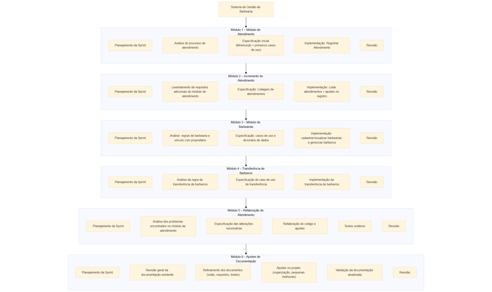

# Plano de Projeto

**Discentes:** Yuri Fernandes, Maria da Paz, João Victor, Lucas Freitas  
**Projeto:** Sistema de Gestão de Barbearias  
**Data:** 10/11/2025  

---

## 1. Escopo do Projeto

Este projeto tem como objetivo principal desenvolver um sistema de gestão completo e acessível para barbearias de pequeno e médio porte.  
A plataforma web será desenvolvida para substituir métodos tradicionais de organização, como agendas físicas e planilhas, oferecendo uma solução digital integrada que permita o gerenciamento eficiente de clientes, agendamentos, serviços e equipe de trabalho.

O sistema busca resolver problemas comuns enfrentados por esses estabelecimentos, como desorganização de horários, dificuldade no controle financeiro e falta de profissionalização no atendimento ao cliente.

O desenvolvimento do projeto seguirá boas práticas para garantir que o sistema seja estável, seguro e confiável, atendendo às necessidades reais dos usuários. Dessa forma, o produto final oferecerá uma solução prática e eficiente para a gestão de barbearias, contribuindo para a organização, o controle operacional e a melhoria da experiência tanto dos profissionais quanto dos clientes.

Além disso, o sistema tem o objetivo de modernizar as barbearias, oferecendo uma ferramenta digital que ajude os proprietários a tomarem decisões e acompanhar o desempenho do negócio.  
Com funções que reúnem as informações em um só lugar e automatizam tarefas do dia a dia, o projeto busca tornar a administração mais rápida, organizada e eficiente.

---

### 1.1 Objetivo

O objetivo do projeto é desenvolver uma plataforma web intuitiva e funcional que auxilie barbearias de pequeno e médio porte na organização e controle de suas atividades.  
O sistema permitirá o gerenciamento centralizado de clientes, serviços, horários e equipe, promovendo maior eficiência operacional e melhorando a qualidade do atendimento.

---

### 1.2 Entregáveis

Os principais produtos e resultados que serão gerados ao longo do projeto incluem:

- **Plano de Projeto:** documento que descreve o planejamento geral do projeto, incluindo cronograma, estimativas de custo, escopo, equipe e metodologia adotada.  
- **Documento de Visão:** apresenta uma descrição geral do sistema, seus objetivos e público-alvo.  
- **Documento de Requisitos:** lista detalhada das funcionalidades, restrições e regras de negócio.  
- **Especificações Técnicas:** informações técnicas sobre a estrutura e funcionamento do sistema.  
- **Plano de Testes:** documento que define como as funcionalidades serão verificadas e validadas.  
- **Sistema Pronto:** versão final e funcional da plataforma web acessível pelo navegador.  
- **Código-Fonte:** todo o código desenvolvido, acompanhado de instruções para implantação.  
- **Relatório Final:** resumo de todas as etapas do projeto, resultados e conclusões.

---

### 1.3 Limites do Escopo

- Não vamos fazer **sistema de pagamento** – o sistema não vai processar pagamentos com cartão ou outras formas.  
- Não vamos criar **aplicativo para celular** – o sistema vai funcionar pelo navegador do celular e computador.  
- Não vai ter **login por redes sociais** – os usuários vão fazer cadastro direto no sistema.  
- Não terá **controle de estoque** – não vamos gerenciar produtos em estoque.  

---

## 2. Cronograma

| Etapa | Descrição | Início | Término | Responsável |
|-------|------------|--------|----------|--------------|
| 1 | Planejamento e Levantamento de Requisitos | 05/10/2025 | 09/10/2025 | Analista de Negócio, Analista de Requisito e Qualidade |
| 2 | Especificação e Modelagem | 10/10/2025 | 18/10/2025 | Analista de Requisito e Qualidade |
| 3 | Desenvolvimento do Sistema | 19/10/2025 | 04/11/2025 | Desenvolvedor |
| 4 | Testes e Qualidade | 07/11/2025 | 18/11/2025 | Desenvolvedor, Analista de Requisito e Qualidade |
| 5 | Implantação e Encerramento | 25/11/2025 | 25/11/2025 | Toda Equipe |

---

## 3. Estimativas de Esforço e Custo

| ID | Atividade | Esforço (h) | Custo/h (R$) | Custo Total (R$) | Responsável |
|----|------------|-------------|---------------|------------------|--------------|
| EC01 | Levantamento de Requisitos e Documento de Visão | 30 | 15,00 | 450,00 | Analista de Negócio, Analista de Requisito e Qualidade |
| EC02 | Especificação de Requisitos e Diagramas | 40 | 15,00 | 600,00 | Analista de Requisito e Qualidade |
| EC03 | Desenvolvimento das Funcionalidades do Sistema | 100 | 20,00 | 2.000,00 | Desenvolvedor |
| EC04 | Elaboração e Execução de Testes | 40 | 15,00 | 600,00 | Desenvolvedor, Analista de Requisito e Qualidade |
| EC05 | Finalização e Entrega do Produto | 30 | 12,50 | 375,00 | Toda Equipe |

---

## 4. EAP - Estrutura Analítica do Projeto

---

## 4.1 Definição das Atividades dos Pacotes de Trabalho (EAP por Módulo / Sprint)

> A seção abaixo descreve, **por módulo (sprint)** conforme o diagrama fornecido, os pacotes de trabalho do EAP. Cada módulo segue o processo acordado (Planejar → Analisar → Especificar → Codificar → Testar* → Revisar).  
> Observação: testes formais aparecem a partir do Módulo 5 (Sprint 5); Módulo 6 inclui validação da documentação.

---

### Módulo 1 — Módulo de Atendimento (Sprint 1)  
**Objetivo:** Entregar o primeiro incremento do módulo de atendimento, permitindo registrar atendimentos e consolidar entendimento do fluxo.  
**Entregável:** Implementação inicial: Registrar Atendimento (incremento mínimo) + documentação mínima (minimundo).

- **Planejamento da Sprint**  
  - **Atividades:** definir escopo do incremento, selecionar backlog (histórias), definir critérios de aceite.  
  - **Recursos:** Backlog, template de critérios de aceite, board.  
  - **Responsáveis:** GP (coord.), AN (priorização).

- **Análise do processo de atendimento**  
  - **Atividades:** entrevistar barbeiros/usuários, mapear fluxo (minimundo), identificar regras críticas (horários, campos obrigatórios).  
  - **Recursos:** Sessões com stakeholders, notas de entrevista.  
  - **Responsáveis:** AN; ARQ.

- **Especificação inicial**  
  - **Atividades:** modelar entidades básicas (atendimento, cliente, barbeiro), descrever o caso de uso “Registrar Atendimento”, definir campos e restrições.  
  - **Recursos:** Ferramenta de modelagem (UML), template de caso de uso.  
  - **Responsáveis:** ARQ; AN.

- **Implementação: Registrar Atendimento**  
  - **Atividades:** criar migrations/BD mínimos, implementar endpoint/serviço para registro, criar UI/formulário simples.  
  - **Recursos:** IDE, repositório, ambiente de desenvolvimento.  
  - **Responsáveis:** Desenvolvedor.

- **Revisão**  
  - **Atividades:** demonstrar incremento, coletar feedback, ajustar backlog.  
  - **Recursos:** Ambiente de teste, checklist de entrega.  
  - **Responsáveis:** GP; AN; ARQ; Desenvolvedor.

---

### Módulo 2 — Incremento do Atendimento (Sprint 2)  
**Objetivo:** Ampliar o módulo de atendimento com listagem e refinamentos do fluxo.  
**Entregável:** Listagem de atendimentos e correções no registro.

- **Planejamento da Sprint**  
  - **Atividades:** priorizar itens (filtros, ordenação, correções), definir critérios de aceite.  
  - **Recursos:** Backlog atualizado, board.  
  - **Responsáveis:** GP; AN.

- **Levantamento de requisitos adicionais**  
  - **Atividades:** coletar necessidades de filtragem, paginação, campos adicionais; identificar validações pendentes.  
  - **Recursos:** Feedback da Sprint 1, logs de uso.  
  - **Responsáveis:** AN; ARQ.

- **Especificação: Listagem de atendimentos**  
  - **Atividades:** detalhar contratos de API para listagem, definir parâmetros (data, barbeiro, status) e formato de resposta.  
  - **Recursos:** Documento de Especificação em andamento; OpenAPI (se aplicado).  
  - **Responsáveis:** ARQ; Desenvolvedor (validação técnica).

- **Implementação: Listar atendimentos + ajustes no registro**  
  - **Atividades:** implementar endpoints de consulta, UI de listagem/filtragem, aplicar correções no fluxo de registro.  
  - **Recursos:** Código-base, DB, ambiente dev.  
  - **Responsáveis:** Desenvolvedor.

- **Revisão**  
  - **Atividades:** demonstração, validação com stakeholders, consolidar pendências.  
  - **Recursos:** Ambiente de teste, registro de feedback.  
  - **Responsáveis:** GP; AN; ARQ; Desenvolvedor.

---

### Módulo 3 — Módulo de Barbearias (Sprint 3)  
**Objetivo:** Permitir que proprietários cadastrem e visualizem barbearias e gerenciem barbeiros.  
**Entregável:** Módulo de Gestão de Barbearias (CRUD e telas de gestão).

- **Planejamento da Sprint**  
  - **Atividades:** selecionar histórias (cadastro, visualização, gestão de barbeiros), definir critérios de aceite.  
  - **Recursos:** Backlog, reunião de planejamento.  
  - **Responsáveis:** GP; AN.

- **Análise: regras de barbearia e vínculo com proprietário**  
  - **Atividades:** mapear permissões, campos obrigatórios, regras de vínculo e restrições operacionais.  
  - **Recursos:** Documento de Visão; entrevistas.  
  - **Responsáveis:** AN; ARQ.

- **Especificação: casos de uso e dicionário de dados**  
  - **Atividades:** descrever casos de uso (Criar/Visualizar Barbearia, Gerenciar Barbeiros), atualizar dicionário de dados.  
  - **Recursos:** Template de casos de uso; ferramenta de modelagem.  
  - **Responsáveis:** ARQ.

- **Implementação: cadastrar/visualizar barbearias e gerenciar barbeiros**  
  - **Atividades:** desenvolver CRUD, telas administrativas, endpoints de vínculo e edição.  
  - **Recursos:** IDE; BD; testes exploratórios.  
  - **Responsáveis:** Desenvolvedor.

- **Revisão**  
  - **Atividades:** demonstração para representante do proprietário, coletar ajustes.  
  - **Recursos:** Checklist de aceite; ambiente de teste.  
  - **Responsáveis:** GP; AN; ARQ; Desenvolvedor.

---

### Módulo 4 — Transferência de Barbeiros (Sprint 4)  
**Objetivo:** Implementar transferência de barbeiros entre unidades com regras de integridade.  
**Entregável:** Funcionalidade de transferência com validações básicas.

- **Planejamento da Sprint**  
  - **Atividades:** definir escopo (pré-condições, autorizações, atualizações métricas), planejar validações.  
  - **Recursos:** Backlog; board.  
  - **Responsáveis:** GP; AN.

- **Análise da regra de transferência**  
  - **Atividades:** especificar pré-condições (ex.: barbeiro ativo), efeitos colaterais (ajuste de relatórios), permissões.  
  - **Recursos:** Notas de requisitos; minimundo.  
  - **Responsáveis:** AN; ARQ.

- **Especificação do caso de uso de transferência**  
  - **Atividades:** documentar fluxo normal e exceções (conflito de horários, dependências).  
  - **Recursos:** Template de caso de uso; diagrama de sequência (se necessário).  
  - **Responsáveis:** ARQ.

- **Implementação da transferência de barbeiros**  
  - **Atividades:** implementar lógica backend, ajustar relacionamentos no banco, criar UI para selecionar destino/confirmar transferência.  
  - **Recursos:** IDE; migrações; ambiente dev.  
  - **Responsáveis:** Desenvolvedor.

- **Revisão**  
  - **Atividades:** validar com cenários reais e corrigir problemas.  
  - **Recursos:** Ambiente de teste; logs.  
  - **Responsáveis:** GP; AN; Desenvolvedor.

---

### Módulo 5 — Refatoração do Atendimento (Sprint 5)  
**Objetivo:** Melhorar arquitetura e qualidade do módulo de atendimento; introduzir testes automatizados.  
**Entregável:** Módulo de Atendimento refatorado com cobertura de testes aumentada.

- **Planejamento da Sprint**  
  - **Atividades:** definir objetivos de qualidade (ex.: metas de cobertura, dívidas técnicas a priorizar), planejar subtarefas.  
  - **Recursos:** Relatório de issues; métricas de qualidade.  
  - **Responsáveis:** GP; ARQ; Desenvolvedor.

- **Análise dos problemas encontrados**  
  - **Atividades:** revisar defeitos recorrentes, identificar pontos de acoplamento e performance.  
  - **Recursos:** Revisões de código; históricos de defeitos.  
  - **Responsáveis:** Desenvolvedor; ARQ.

- **Especificação das alterações necessárias**  
  - **Atividades:** desenhar mudanças (módulos, interfaces), atualizar contratos de API e documentação técnica.  
  - **Recursos:** Documento de arquitetura; templates técnicos.  
  - **Responsáveis:** ARQ; Desenvolvedor.

- **Refatoração do código e ajustes**  
  - **Atividades:** aplicar reorganização de código, extrair responsabilidades, simplificar fluxos.  
  - **Recursos:** Branch de refatoração; IDE; testes.  
  - **Responsáveis:** Desenvolvedor.

- **Testes unitários**  
  - **Atividades:** criar/atualizar testes unitários e de integração; integrar execução em CI (se disponível); executar e corrigir regressões.  
  - **Recursos:** Framework de testes; pipeline CI; dados de teste.  
  - **Responsáveis:** Desenvolvedor; ARQ (validação).

- **Revisão**  
  - **Atividades:** validar critérios de qualidade, aprovar merges, registrar lições aprendidas.  
  - **Recursos:** Relatórios de cobertura; checklist.  
  - **Responsáveis:** GP; ARQ; Desenvolvedor.

---

### Módulo 6 — Ajustes de Documentação (Sprint 6)  
**Objetivo:** Consolidar e validar a documentação técnica e de testes para homologação/entrega.  
**Entregável:** Documentação atualizada (Especificação, Plano de Testes, Dicionário) e pacote de entrega.

- **Planejamento da Sprint**  
  - **Atividades:** listar artefatos a atualizar, atribuir responsáveis e prioridades.  
  - **Recursos:** Repositório de documentos; backlog.  
  - **Responsáveis:** GP; AN; ARQ.

- **Revisão geral da documentação existente**  
  - **Atividades:** auditar Visão, Especificação, Dicionário e Plano de Testes para inconsistências.  
  - **Recursos:** Documentos existentes; versionamento.  
  - **Responsáveis:** ARQ; AN.

- **Refinamento dos documentos**  
  - **Atividades:** atualizar casos de uso, dicionário, exemplos de API, instruções de deploy e plano de testes.  
  - **Recursos:** Ferramentas de edição; templates.  
  - **Responsáveis:** ARQ; AN.

- **Ajustes no projeto (pequenas melhorias)**  
  - **Atividades:** aplicar correções menores no código ou scripts de deploy; atualizar README e instruções.  
  - **Recursos:** Repositório; ambiente de teste.  
  - **Responsáveis:** Desenvolvedor.

- **Validação da documentação atualizada**  
  - **Atividades:** verificar cobertura do plano de testes frente às alterações; preparar checklist de homologação.  
  - **Recursos:** Checklist de homologação; ambiente de homologação.  
  - **Responsáveis:** GP; ARQ; AN.

- **Revisão**  
  - **Atividades:** reunião final para registrar lições aprendidas e ajustar plano de encerramento.  
  - **Recursos:** Registro de retrospectiva.  
  - **Responsáveis:** Toda a equipe.

---

## 5. Lista de Atividades

> **Responsáveis (Mapeamento):**
> * **Yuri Fernandes** — Analista de Negócio e de Requisitos
> * **Maria da Paz** — Analista de Negócio e de Requisitos
> * **João Victor** — Gerente de Projeto e Desenvolvedor
> * **Lucas Freitas** — Desenvolvedor

| ID | Atividade | Início | Término | Status | Responsável |
|:---|:---|:---:|:---:|:---:|:---|
| **Sprint 1 – Módulo de Atendimento (08/10/2025 → 14/10/2025)** | | | | | |
| LA01 | Planejamento da Sprint 1 | 08/10/2025 | 08/10/2025 | Concluído | João Victor |
| LA02 | Análise do processo de atendimento | 09/10/2025 | 10/10/2025 | Concluído | Yuri Fernandes; Maria da Paz |
| LA03 | Especificação inicial (Minimundo + primeiros casos de uso) | 11/10/2025 | 12/10/2025 | Concluído | Yuri Fernandes; Maria da Paz |
| LA04 | Implementação: Registrar Atendimento | 13/10/2025 | 14/10/2025 | Concluído | João Victor; Lucas Freitas |
| LA05 | Revisão da Sprint 1 | 14/10/2025 | 14/10/2025 | Concluído | Toda equipe (coord.: João Victor) |
| **Sprint 2 – Incremento do Atendimento (15/10/2025 → 21/10/2025)** | | | | | |
| LA06 | Planejamento da Sprint 2 | 15/10/2025 | 15/10/2025 | Concluído | João Victor |
| LA07 | Levantamento de requisitos adicionais do módulo de atendimento | 16/10/2025 | 17/10/2025 | Concluído | Yuri Fernandes; Maria da Paz |
| LA08 | Especificação: Listagem de atendimentos | 18/10/2025 | 18/10/2025 | Concluído | Yuri Fernandes; Maria da Paz |
| LA09 | Implementação: Listar atendimentos + ajustes no registro | 19/10/2025 | 20/10/2025 | Concluído | João Victor; Lucas Freitas |
| LA10 | Revisão da Sprint 2 | 21/10/2025 | 21/10/2025 | Concluído | Toda equipe (coord.: João Victor) |
| **Sprint 3 – Módulo de Barbearias (22/10/2025 → 28/10/2025)** | | | | | |
| LA11 | Planejamento da Sprint 3 | 22/10/2025 | 22/10/2025 | Concluído | João Victor |
| LA12 | Análise: regras de barbearia e vínculo com proprietários | 23/10/2025 | 24/10/2025 | Concluído | Yuri Fernandes; Maria da Paz |
| LA13 | Especificação: Casos de uso e Dicionário de Dados | 25/10/2025 | 26/10/2025 | Concluído | Yuri Fernandes; Maria da Paz |
| LA14 | Implementação: cadastrar/visualizar barbearias e gerenciar barbeiros | 27/10/2025 | 28/10/2025 | Concluído | João Victor; Lucas Freitas |
| LA15 | Revisão da Sprint 3 | 28/10/2025 | 28/10/2025 | Concluído | Toda equipe (coord.: João Victor) |
| **Sprint 4 – Transferência de Barbeiros (29/10/2025 → 04/11/2025)** | | | | | |
| LA16 | Planejamento da Sprint 4 | 29/10/2025 | 29/10/2025 | Concluído | João Victor |
| LA17 | Análise: regra de transferência de barbeiros | 30/10/2025 | 31/10/2025 | Concluído | Yuri Fernandes; Maria da Paz |
| LA18 | Especificação: Caso de uso de transferência | 01/11/2025 | 01/11/2025 | Concluído | Yuri Fernandes; Maria da Paz |
| LA19 | Implementação da transferência de barbeiros | 02/11/2025 | 03/11/2025 | Concluído | João Victor; Lucas Freitas |
| LA20 | Revisão da Sprint 4 | 04/11/2025 | 04/11/2025 | Concluído | Toda equipe (coord.: João Victor) |
| **Sprint 5 – Refatoração do Atendimento (05/11/2025 → 11/11/2025)** | | | | | |
| LA21 | Planejamento da Sprint 5 | 05/11/2025 | 05/11/2025 | Concluído | João Victor |
| LA22 | Análise dos problemas encontrados no módulo de atendimento | 06/11/2025 | 07/11/2025 | Concluído | Yuri Fernandes; Maria da Paz |
| LA23 | Especificação das alterações necessárias | 08/11/2025 | 08/11/2025 | Concluído | Yuri Fernandes; Maria da Paz |
| LA24 | Refatoração do código e ajustes | 09/11/2025 | 10/11/2025 | Concluído | João Victor; Lucas Freitas |
| LA25 | Implementação de Testes Unitários | 11/11/2025 | 11/11/2025 | Concluído | João Victor |
| LA26 | Revisão da Sprint 5 | 11/11/2025 | 11/11/2025 | Concluído | Toda equipe (coord.: João Victor) |
| **Sprint 6 – Ajustes de Documentação (12/11/2025 → 19/11/2025)** | | | | | |
| LA27 | Planejamento da Sprint 6 | 12/11/2025 | 12/11/2025 | Concluído | João Victor |
| LA28 | Revisão geral da documentação existente | 13/11/2025 | 14/11/2025 | Concluído | Yuri Fernandes; Maria da Paz |
| LA29 | Refinamento dos documentos (visão, requisitos, testes) | 15/11/2025 | 16/11/2025 | Concluído | Yuri Fernandes; Maria da Paz |
| LA30 | Ajustes no projeto (organização e pequenas melhorias) | 17/11/2025 | 17/11/2025 | Concluído | João Victor; Lucas Freitas |
| LA31 | Validação da documentação atualizada | 18/11/2025 | 18/11/2025 | Concluído | João Victor |
| LA32 | Revisão da Sprint 6 | 19/11/2025 | 19/11/2025 | Concluído | Toda equipe (coord.: João Victor) |
| **Encerramento / Pós-sprints** | | | | | |
| LA33 | Entrega do Código Fonte Final | 20/11/2025 | 21/11/2025 | Planejado | João Victor |
| LA34 | Demonstração do Sistema Funcional | 22/11/2025 | 23/11/2025 | Planejado | João Victor; Lucas Freitas |
| LA35 | Apresentação e Avaliação Final | 24/11/2025 | 25/11/2025 | Planejado | Toda equipe |

---

## 6. Diagrama de Gantt

---

## 7. Diagrama de Atividades do Projeto

---

## 8. Ferramentas Utilizadas

Durante o desenvolvimento do sistema foram utilizadas as seguintes ferramentas:

- **GitHub** — repositório de código-fonte, versionamento e controle de versões.  
- **GitHub Projects (Kanban)** — quadro Kanban para gestão do backlog e organização das sprints.  
- **Quadro Kanban (Board do repositório)** — organização visual das tarefas por colunas (To Do / In Progress / Done).  
- **Visual Studio Code (VSCode)** — editor/IDE utilizado pelos desenvolvedores para codificação, debugging e execução de testes locais.  

---

## 9. Gráfico Burndown

[Gráfico Burndown](https://docs.google.com/spreadsheets/d/1RyWtdgVLxNj2ofCtK0qOfNu-o7zLXOjH/edit?usp=sharing&ouid=117602761760046031828&rtpof=true&sd=true)
